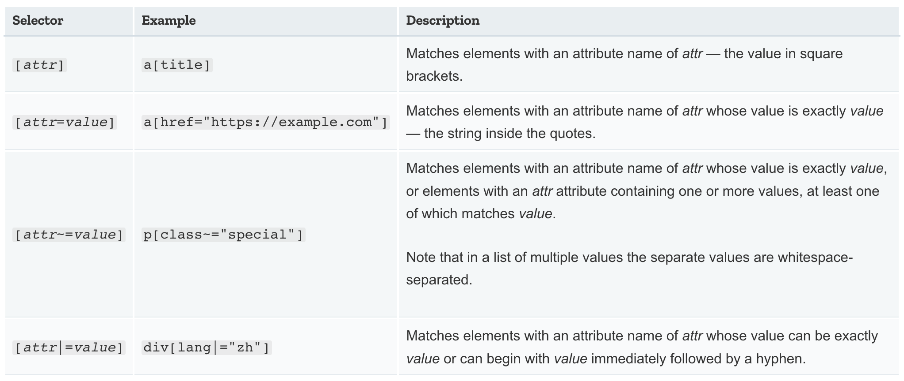
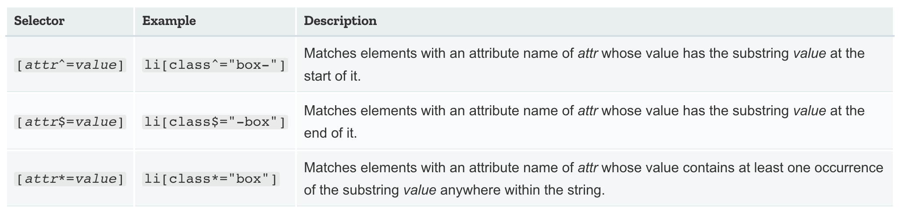

# CSS Inheritance
### Inheritance Property Values
```inherit```  
Sets the property value applied to a selected element to be the same as that of its parent element. Effectively, this "turns on inheritance".

```initial```  
Sets the property value applied to a selected element to be the same as the value set for that property on that element in the browser's default style sheet. If no value is set by the browser's default style sheet and the property is naturally inherited, then the property value is set to inherit instead.  
From stackoverflow:  
Denotes the initial value of the property, as defined in CSS specifications: “The ‘initial’ keyword represents the specified value that is designated as the property's initial value.” Thus, its meaning depends on the property, but not on anything else, e.g. not on the browser or on the element that the property is being applied to. So it does not mean browser default.
    
```unset```  
  Resets the property to its natural value, which means that if the property is naturally inherited it acts like inherit, otherwise it acts like initial. 

  <br/>


### Resetting all property values
The CSS shorthand property ```all``` can be used to apply one of these inheritance values to (almost) all properties at once. Its value can be any one of the inheritance values (inherit, initial, unset, or revert). It's a convenient way to undo changes made to styles so that you can get back to a known starting point before beginning new changes.

## Cascade
There are three factors to consider, listed here in decreasing order of importance. Earlier ones overrule later ones:  
1. Importance
2. Specificity
3. Source order  

<br/>

# Selectors
### Selector lists
If you have more than one thing which uses the same CSS then the individual selectors can be combined into a selector list with a comma, so that the rule is applied to all of the individual selectors. When you group selectors in this way, if any selector is invalid the whole rule will be ignored.  
<br>

## Types of selectors
- **Type, class, and ID selectors**  

- **Attribute selectors**  
  This group of selectors gives you different ways to select elements based on the presence of a certain attribute on an element:
  ```CSS
  a[title] { }
  ```
  Or even make a selection based on the presence of an attribute with a particular value:
  ```CSS
  a[href="https://example.com"] { }
  ```

- **Pseudo-classes and pseudo-elements**  
  This group of selectors includes pseudo-classes, which style certain states of an element.
  ```CSS
  a:hover { }
  ```
  It also includes pseudo-elements, which select a certain part of an element rather than the element itself. For example, ::first-line always selects the first line of text inside an element, acting as if a ```<span>``` was wrapped around the first formatted line and then selected.
  ```CSS
  p::first-line { }
  ```

- **Combinators**
  The final group of selectors combine other selectors in order to target elements within our documents. The following for example selects paragraphs that are direct children of ```<article>``` elements using the child combinator (>):
  ```CSS
  article > p { }
  ```  
<br>

### The universal selector
The universal selector is indicated by an asterisk (*) and selects everything in the document (or inside the parent element if it is being chained together with another element and a descendant combinator, for example).  

One use of the universal selector is to make selectors easier to read and more obvious in terms of what they are doing. For example, if I wanted to select the first child of any ```<article>``` element, no matter what element it was, and make it bold, I could use the ```:first-child``` selector as a descendant selector along with the ```<article>``` element selector:  
```article :first-child```  

This could be confused however with ```article:first-child```, which will select any ```<article>``` element that is the first child of another element.  
To avoid this confusion we can add the universal selector to the :first-child selector, so it is obvious what the selector is doing. It is selecting any element which is the first-child of an ```<article>``` element:
```CSS
article *:first-child { 

}
```  
<br>

### Targeting classes on particular element
You can create a selector that will target specific elements with the class applied. We do this by using the type selector for the element we want to target with the class appended and no white space in between.
```CSS
span.highlight {
    background-color: yellow;
}
```  
This approach does make the CSS less reusable as the class will now only apply to that particular element, and you would need to add another selector if you decided that the rules should apply to other elements too.  
<br>

## Presence and value selectors
These selectors enable the selection of an element based on the presence of an attribute alone (for example href), or on various different matches against the value of the attribute.  

  

  

If you want to match attribute values case-insensitively you can use the value i before the closing bracket. This flag tells the browser to match ASCII characters case-insensitively.
```CSS
li[class^="a" i] {
    color: red;
}
```  

## Pseudo Class Selectors
A pseudo-class is a selector that selects elements that are in a specific state, e.g. they are the first element of their type, or they are being hovered over by the mouse pointer. They tend to act as if you had applied a class to some part of your document, often helping you cut down on excess classes in your markup, and giving you more flexible, maintainable code.
Pseudo-classes are keywords that start with a colon.  

Pseudo-elements behave in a similar way, however they act as if you had added a whole new HTML element into the markup, rather than applying a class to existing elements. Pseudo-elements start with a double colon.  
<br>

### Generating content with ::before and ::after
There are a couple of special pseudo-elements, which are used along with the content property to insert content into your document using CSS. Inserting strings of text from CSS isn't really something we do very often on the web however, as that text is inaccessible to some screen readers and might be hard for someone to find and edit in the future.  
A more valid use of these pseudo-elements is to insert an icon which is a visual indicator that we wouldn't want read out by a screenreader.  
These pseudo-elements are also frequently used to insert an empty string, which can then be styled just like any element on the page.  

[MDN List of Pseudo Selectors](https://developer.mozilla.org/en-US/docs/Learn/CSS/Building_blocks/Selectors/Pseudo-classes_and_pseudo-elements#Reference_section)  

<br>

## Combinators
**Descendant selector**  
Selectors with spaces in between them. These selectors select elements that are descendants of others selector. They do not need to be direct children to match.  

**Child combinator**  
The child combinator is a greater-than symbol (>), which matches only when the selectors select elements that are direct children. Descendants further down the hierarchy don't match.  

**Adjacent sibling**  
The adjacent sibling selector (+) is used to select something if it is right next to another element at the same level of the hierarchy.  

**General sibling**  
If you want to select siblings of an element even if they are not directly adjacent, then you can use the general sibling combinator (~). 

---------
source: https://developer.mozilla.org